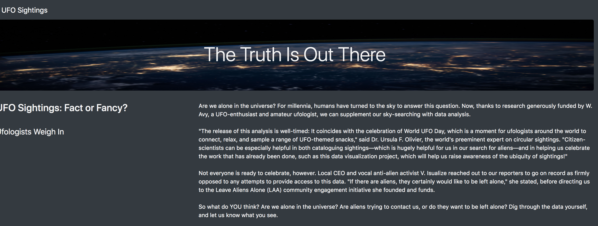
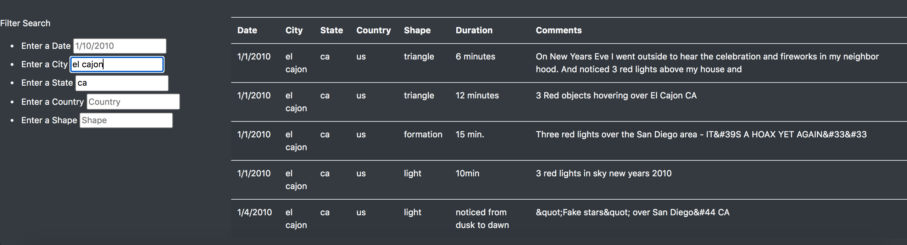

# UFOs

## Overview of Project

 For this project, we have built an HTML page that will allow us to pull up UFO sighting information from a javascript data file and creating filters to filter the results. The user can filter the information by date, city, state, country, and even the shape of the sighting.

## Results: 

When the user opens the webpage, they are first greeted with a header title, image, and introduction paragraph. As the user scrolls down they will begin to see all the data and the available filters on the left side of the page. 

As you see in the image above, there are five available filters to choose from; the date, city, state, country & shape. The user may choose any one of the filters to enter in the search bar and the HTML page will show all of the sightings for that specific search. Multiple filters can be entered at the same time to further inspect the data.

## Summary: 

The current webpage has a clean interface that allows the user to filter through the different sightings in our dataset. One drawback to our page is the lack of images. More likely than not, individuals take pictures of the sightings especially when they've lasted for a long time. My recommendation would add this data to the dataset in a new column that displays an image of the sighting. I would also add another filter to filter the duration of the sightings or at least order them from shortest to longest. 

